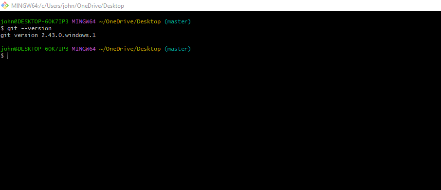
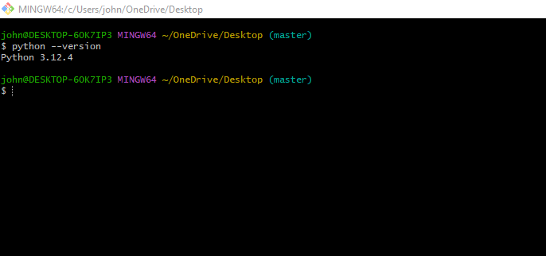
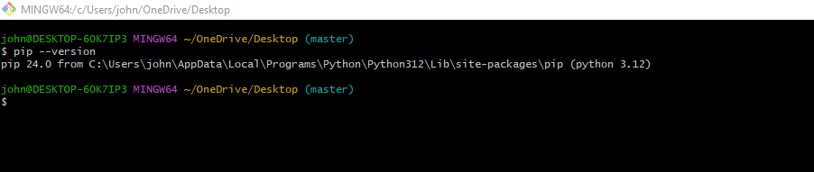
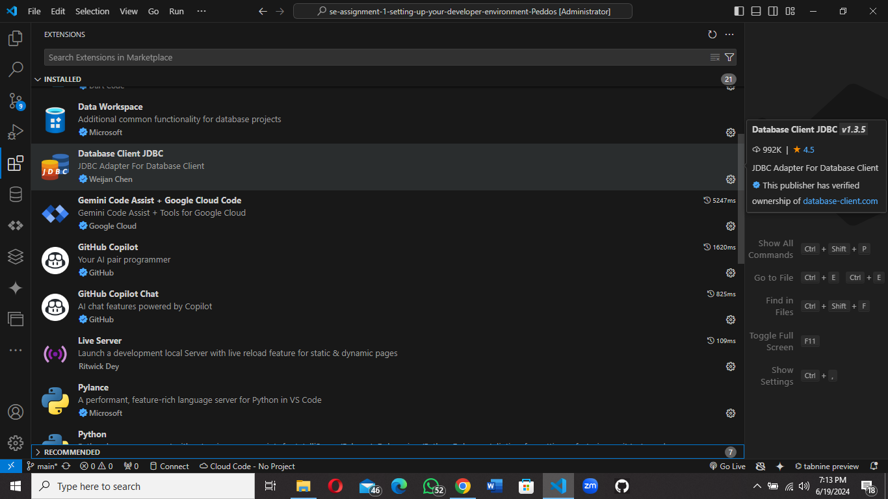

# Dev_Setup
Setup Development Environment

#Assignment: Setting Up Your Developer Environment

#Objective:
This assignment aims to familiarize you with the tools and configurations necessary to set up an efficient developer environment for software engineering projects. Completing this assignment will give you the skills required to set up a robust and productive workspace conducive to coding, debugging, version control, and collaboration.

#Tasks:

1. Select Your Operating System (OS):
   Choose an operating system that best suits your preferences and project requirements. Download and Install Windows 11. https://www.microsoft.com/software-download/windows11

2. Install a Text Editor or Integrated Development Environment (IDE):
   Select and install a text editor or IDE suitable for your programming languages and workflow. Download and Install Visual Studio Code. https://code.visualstudio.com/Download
3. Set Up Version Control System:
   Install Git and configure it on your local machine. Create a GitHub account for hosting your repositories. Initialize a Git repository for your project and make your first commit. https://github.com

4. Install Necessary Programming Languages and Runtimes:
  Instal Python from http://wwww.python.org programming language required for your project and install their respective compilers, interpreters, or runtimes. Ensure you have the necessary tools to build and execute your code.

5. Install Package Managers:
   If applicable, install package managers like pip (Python).

6. Configure a Database (MySQL):
   Download and install MySQL database. https://dev.mysql.com/downloads/windows/installer/5.7.html

7. Set Up Development Environments and Virtualization (Optional):
   Consider using virtualization tools like Docker or virtual machines to isolate project dependencies and ensure consistent environments across different machines.

8. Explore Extensions and Plugins:
   Explore available extensions, plugins, and add-ons for your chosen text editor or IDE to enhance functionality, such as syntax highlighting, linting, code formatting, and version control integration.

9. Document Your Setup:
    Create a comprehensive document outlining the steps you've taken to set up your developer environment. Include any configurations, customizations, or troubleshooting steps encountered during the process. 

#Deliverables:
- Document detailing the setup process with step-by-step instructions and screenshots where necessary.
- A GitHub repository containing a sample project initialized with Git and any necessary configuration files (e.g., .gitignore).
- A reflection on the challenges faced during setup and strategies employed to overcome them.

#Submission:
Submit your document and GitHub repository link through the designated platform or email to the instructor by the specified deadline.

#Evaluation Criteria:**
- Completeness and accuracy of setup documentation.
- Effectiveness of version control implementation.
- Appropriateness of tools selected for the project requirements.
- Clarity of reflection on challenges and solutions encountered.
- Adherence to submission guidelines and deadlines.

Note: Feel free to reach out for clarification or assistance with any aspect of the assignment.
 
answers
1.

Steps for Downloading Windows 11:

Check System Requirements: Before you start, make sure your computer meets the minimum system requirements for Windows 11. You can find this information on the Microsoft website.

Create a Bootable USB Drive: You'll need a USB drive with at least 8GB of free space to create a bootable installation media.

Download the Windows 11 Installation Media:

Go to the official Microsoft website for Windows 11 downloads.
Select the "Download Windows 11" option.
Choose the language and edition of Windows 11 you want to install.
Click the "Download" button.
The download will begin.
Create the Bootable USB Drive:

Once the download is complete, open the downloaded file.
Follow the on-screen instructions to create the bootable USB drive.
You'll need to select the USB drive you want to use and follow the prompts.
Install Windows 11:

Restart your computer and boot from the USB drive.
Follow the on-screen instructions to install Windows 11.
You'll need to choose your language, region, and keyboard layout.
You'll also need to accept the license terms and choose whether to install a custom or clean installation.
Important Notes:

Backup Your Data: Before installing Windows 11, make sure to back up all your important data.
Clean Installation: A clean installation will erase all data on your hard drive. If you want to keep your existing data, choose a custom installation.

2.

Installing Visual Studio Code:
Download Visual Studio Code:

Go to the official Visual Studio Code website: https://code.visualstudio.com/Download
Select the appropriate installer for your operating system (Windows, macOS, or Linux).
Click the "Download" button.
Run the Installer:

Once the download is complete, locate the downloaded installer file.
Double-click the installer file to start the installation process.
Follow the Installation Wizard:

The installation wizard will guide you through the process.
You'll likely be asked to:
Choose the installation location.
Select any additional components you want to install (like the "Code" command-line interface).
Agree to the license terms.
Complete the Installation:

Click the "Finish" button to complete the installation.
Launch Visual Studio Code:

3.

Setting Up Version Control with Git and GitHub:

1. Install Git:

Download Git: Go to the official Git website: https://git-scm.com/downloads
Choose Your Installer: Select the installer that matches your operating system (Windows, macOS, or Linux).
Run the Installer: Follow the on-screen instructions to install Git. You'll likely be asked to choose default settings, such as your text editor and command-line interface.
2. Configure Git:

Open a Terminal or Command Prompt: Open your terminal or command prompt.
Set Your User Name:
git config --global user.name "Your Name"
Replace "Your Name" with your actual name.
Set Your Email Address:
git config --global user.email "your_email@example.com"
Replace "your_email@example.com" with your email address.
3. Create a GitHub Account:

Go to GitHub: Visit the GitHub website: https://github.com
Sign Up: Click the "Sign up" button and create a free account.
4. Create a Git Repository:

Open a Terminal or Command Prompt: Open your terminal or command prompt.
Navigate to Your Project Directory: Use the cd command to navigate to the folder where your project is located.
Initialize a Git Repository:
git init
This creates a hidden .git folder in your project directory, which contains all the Git information.
5. Add Files to the Repository:

Stage Files: Use the git add command to add files to the staging area. For example, to add all files:
git add .
Commit Changes: Use the git commit command to create a snapshot of your changes. Include a descriptive message:
git commit -m "Initial commit"
Replace "Initial commit" with a message that describes the changes you made.
6. Connect to GitHub:

Create a New Repository on GitHub: Log in to your GitHub account and create a new repository.
Get the Remote Repository URL: Copy the URL of your new repository from GitHub.
Add the Remote Repository: In your terminal, use the git remote add command to connect your local repository to the remote repository on GitHub:
git remote add origin <remote_repository_url>
Replace <remote_repository_url> with the URL you copied from GitHub.
7. Push Changes to GitHub:

Push to the Remote Repository: Use the git push command to send your local changes to GitHub:
git push origin main
Replace main with the name of your branch if it's not main.
8. Work with Git:

Make Changes: Continue working on your project, making changes to your files.
Stage and Commit: Use git add and git commit to track your changes.
Push to GitHub: Use git push to keep your GitHub repository up-to-date.
9. Pull Changes from GitHub:

Fetch Changes: Use git fetch to download the latest changes from GitHub.
Merge Changes: Use git merge to integrate the changes from GitHub into your local repository.
Key Points:

4

Installing Python: A Step-by-Step Guide

1. Download Python

   - Visit the Python Website: Go to the official Python website: [https://www.python.org/](https://www.python.org/)
   - Download the Latest Version: Click on the "Downloads" tab and select the latest version of Python for your operating system (Windows, macOS, or Linux).
   - Choose the Installer:  Select the appropriate installer for your system (usually the "executable installer" for Windows).
   - Run the Installer:  Double-click the downloaded installer file to start the installation process.

2. Install Python

   - Follow the Installer Instructions:  The Python installer will guide you through the installation process.
   - Choose Installation Options:  You'll likely be asked to:
      -Select the Installation Location:  Choose where you want to install Python on your computer.
      - Add Python to PATH:  Make sure to check the option to add Python to your system's PATH environment variable. This makes it easier to run Python from your command prompt or terminal.
      - Customize Installation:  You can choose additional options, such as installing Python documentation or associating Python files with the Python interpreter.
   - Complete the Installation:  Click the "Finish" button to complete the installation.

 3. Verify Python Installation

   - Open a Terminal or Command Prompt:  Open your terminal or command prompt.
   - Type `python --version`: This command will display the version of Python you just installed.

 Key Points:

- PATH Environment Variable:  Adding Python to your PATH makes it easier to run Python from anywhere on your computer.
- 

5
pip install

6
 Download and Install MySQL

Go to the MySQL Website: Visit the official MySQL downloads page: https://dev.mysql.com/downloads/mysql/
Choose Your Version: Select the appropriate version of MySQL for your operating system (Windows, macOS, or Linux).
Download the Installer: Download the installer file for your system.
Run the Installer: Double-click the downloaded installer file to start the installation process.
Follow the Installer Instructions: The MySQL installer will guide you through the installation process. You'll likely be asked to:
Choose Installation Options: Select the components you want to install (e.g., server, client, documentation).
Set a Root Password: Choose a strong password for the MySQL root user. This is the administrator account for your database.
Configure Settings: You might be able to customize settings like the default port number and the location of the data files.
Complete the Installation: Click the "Finish" button to complete the installation.
2. Access the MySQL Shell

Open a Terminal or Command Prompt: Open your terminal or command prompt.
Log in as Root: Type the following command and replace <your_root_password> with the password you set during installation:
mysql -u root -p
Enter Your Password: You'll be prompted to enter your root password.
3. Create a Database

Inside the MySQL Shell: Once you're logged in, you can create a new database. For example, to create a database named "my_database":
CREATE DATABASE my_database;
4. Create a User (Optional)

Create a User: If you want to create a user with specific permissions for your database, use the following command (replace <username> and <password> with your desired values):
CREATE USER '<username>'@'localhost' IDENTIFIED BY '<password>';
Grant Permissions: Grant the user permissions to access the database. For example, to grant all privileges to the user:
GRANT ALL PRIVILEGES ON my_database.* TO '<username>'@'localhost';
5. Connect to the Database

From Your Application: You can now connect to your MySQL database from your application using the appropriate database connector library (e.g., mysql.connector for Python).

7.

